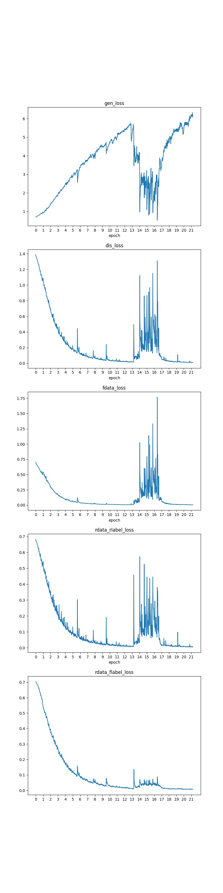
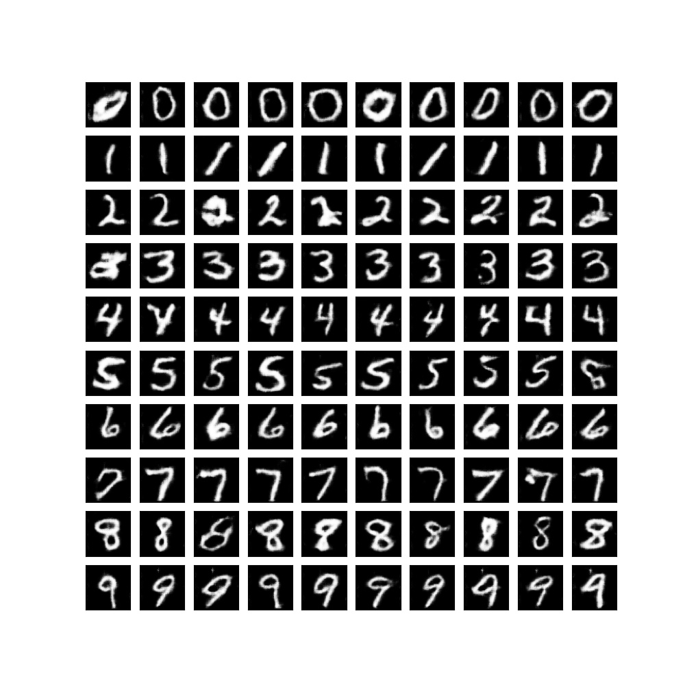

# Conditional GAN
Giving a random tensor and a label(0-9), generate an hand-write image. 

[paper](https://arxiv.org/pdf/1411.1784.pdf)
## Dataset
MNIST
## Train
```python
python tools/train.py
```
## Test
```python
python tools/test.py
```
## Loss curve

## results

