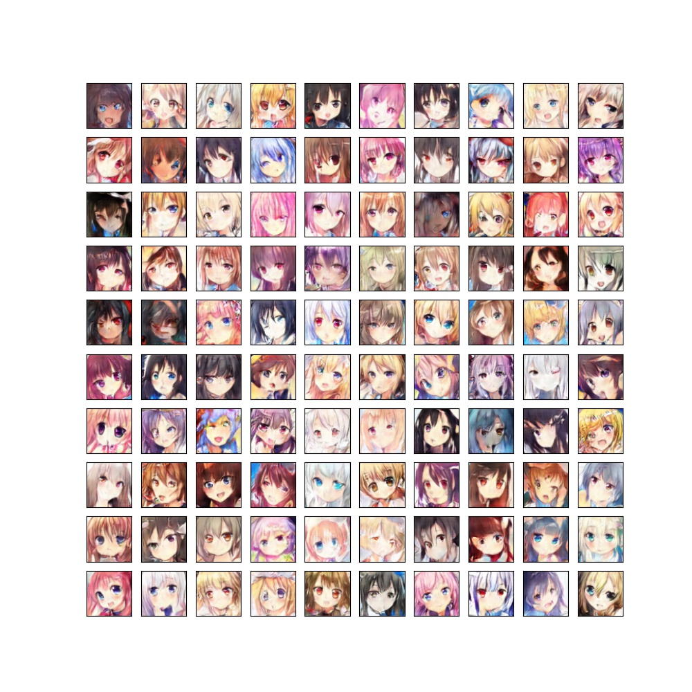
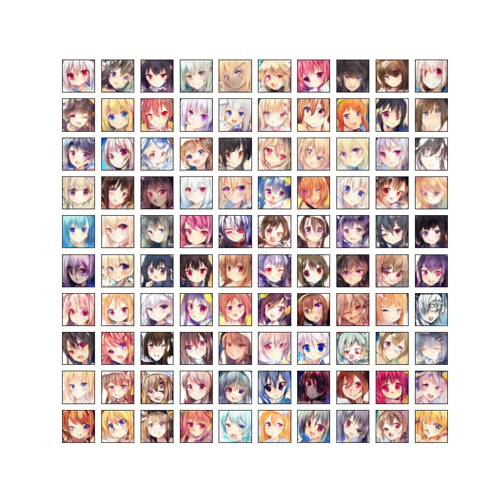
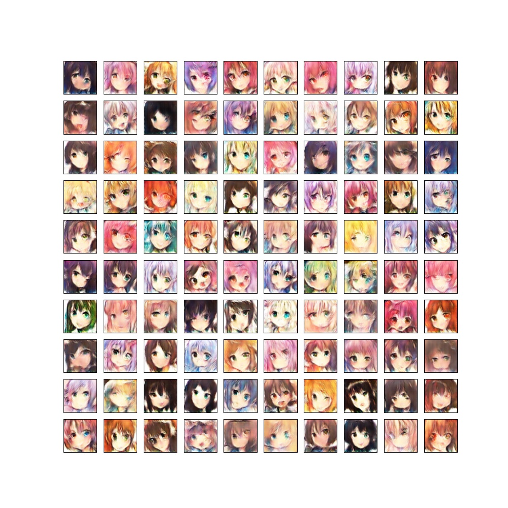
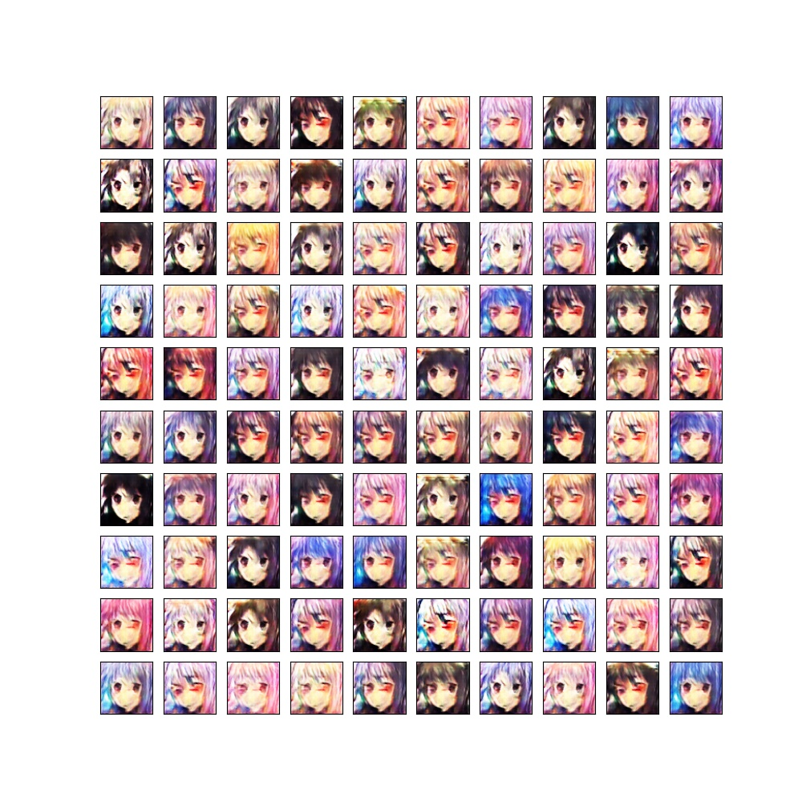
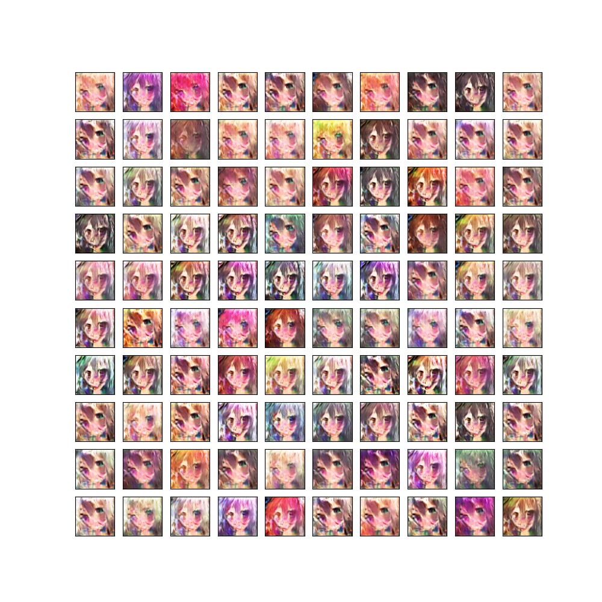
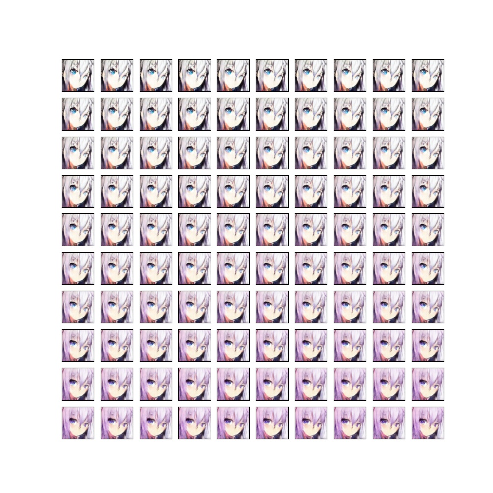

# Generator Cartoon faces using DCGAN
## Dataset
百度网盘: 链接:https://pan.baidu.com/s/1frjTi5pf32OH3S87jUJj5Q  密码:288t
## Train
```
python tools/train.py
```
## Test
```
python tools/test.py
```
## results
### Discriminator with lrelu(0.2), ADAM(betas=(0.5, 0.999)), lr=0.0002
Collapse after train about 45 epochs: discriminator loss == 0., generator loss=18., generator only generates one image(noisy)

### Discriminator with relu, ADAM(betas=（0.5， 0.999)), lr=0.0002
Collapse after train about 45 epochs: discriminator loss == 0., generator loss goes very large, generator only generates one image(noisy)

### Discriminator with lrelu(0.2), ADAM(betas=(0.9, 0.999)), lr=0.0002
It seems that after long time of training, generator overfits and only generates similar faces
#### epoch 50

#### epoch 100

#### epoch 460

## Change dim4 continuously

